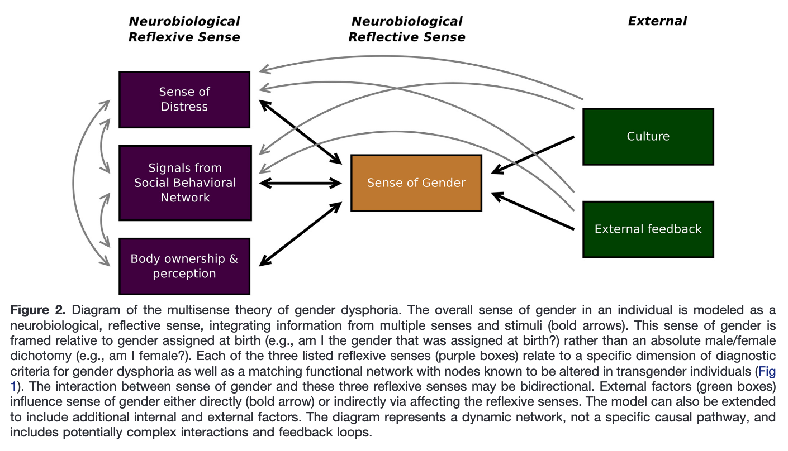

.. gliske_model documentation master file, created by
   sphinx-quickstart on Sat Mar 13 22:49:02 2021.
   You can adapt this file completely to your liking, but it should at least
   contain the root `toctree` directive.

Lets uh simulate the dang thing
========================================

Implements the "model" in the gliske paper as a simple dynamic system.

Installation
-------------

* Clone the thing::

   git clone https://github.com/sneakers-the-rat/svg_model

* Install the dang thing::

   pip install ./svg_model

* Use the dang thing::

   from svg_model import SVG_Model

   mod = SVG_Model()

   # run the model for one second
   mod.run(1)

   # get the data
   df = mod.collect_monitors()

   # lmao
   df.plot(x='timestamp', y=['distress', 'social_behavioral', 'body_ownership', 'gender', 'culture', 'feedback'])

* Reparameterize it too::

   mod = SVG_Model(
      weights = (0.2, 0.4),
      tau     = 5, # make the decay time constant 5 seconds
      # set resting values...
      resting = {
         'distress': 0.8,
         'social_behavioral': 0.2,
         'body_ownership': 0.5,
         'gender': 0.5,
         'culture': -1.0,
         'feedback': -0.3
      })

See the :class:`svg_model.model.SVG_Model` class documentation for more specifics

.. toctree::
   :maxdepth: 2
   :caption: Contents:

   Model Docs <model>

Indices and tables
==================

* :ref:`genindex`
* :ref:`modindex`
* :ref:`search`
